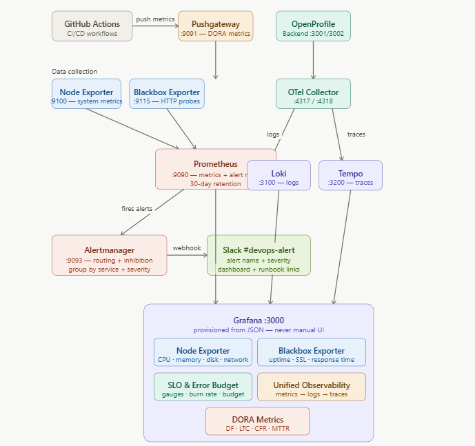

# OpenProfile Observability Stack

A production-grade observability and reliability platform built on the LGTM stack (Loki, Grafana, Tempo, Prometheus) for the OpenProfile application.

## Live Presentation

📊 Presentation Slides:  
You can view the full project presentation slides here: https://canva.link/vpv0rr13wz30go4

---

## One Command Deployment

```bash
terraform apply
```

This single command:
- Opens all required ports on the AWS security group
- SSHes into the monitoring server
- Installs and configures all 8 monitoring tools as systemd services
- Deploys all Grafana dashboards
- Configures all alert rules
- Starts everything automatically

To tear down the monitoring stack:
```bash
terraform destroy
```

---

## Architecture



## Stack Components

| Tool              |      Port |   Purpose                             |
|---                |---        |        ---                            |
| Prometheus        | 9090      | Metrics collection and storage        |
| Loki              | 3100      | Log aggregation and querying          |
| Tempo             | 3200      | Distributed tracing backend           |
| Grafana           | 3000      | Unified observability frontend        |
| Alertmanager      | 9093      | Alert routing and Slack notifications |
| Node Exporter     | 9100      | Server-level metrics (CPU, RAM, disk) |
| Blackbox Exporter | 9115      | HTTP uptime and SSL expiry probing    |
| Pushgateway       | 9091      | DORA metrics from GitHub Actions      |

---

## Prerequisites

- Terraform installed on local machine
- AWS CLI configured with valid credentials
- SSH key pair with access to the monitoring server
- Slack webhook URL 

---

## Setup

**1. Clone the repository**
```bash
git clone https://github.com/YOUR_ORG/open-profile-be.git
cd open-profile-be/observability/terraform
```

**2. Create your tfvars file**
```bash
cp terraform.tfvars.example terraform.tfvars
```

**3. Fill in your values**
```hcl
aws_region             = "us-east-1"
security_group_id      = "sg-xxxxxxxxxxxxxxxxx"
instance_id            = "i-xxxxxxxxxxxxxxxxx"
server_ip              = "YOUR_SERVER_IP"
server_user            = "ubuntu"
ssh_private_key_path   = "~/.ssh/id_xxxx"
grafana_admin_user     = "admin"
grafana_admin_password = "your-secure-password"
slack_webhook_url      = "https://hooks.slack.com/services/..."
```

**4. Deploy**
```bash
terraform init
terraform apply
```

**5. Access Grafana**

Open http://YOUR_SERVER_IP:3000 and login with your configured credentials.

---

## Grafana Dashboards

| Dashboard                          | Description                                |
|---                                 |---                                         |
| Node Exporter — System Health      | CPU, memory, disk, network I/O             |
| Blackbox Exporter — Service Health | Uptime, response time, SSL expiry          |
| SLO & Error Budget                 | SLI gauges, budget remaining, burn rate    |
| Unified Observability              | Metrics → Logs → Traces drill-down         |
| DORA Metrics                       | Deployment frequency, lead time, CFR, MTTR |

---

## Alert Rules

All alert rules are version-controlled in `terraform/templates/alerts/`:

| File                 | Alerts                                                         |
|---                   |---                                                             |
| `infrastructure.yml` | CPU, Memory, Disk, Server Down, SSL Expiry, High Response Time |
| `slo.yml`            | SLO recording rules and error budget tracking                  |
| `slo-burn-rate.yml`  | Fast burn (critical), Slow burn (warning), Budget exhausted    |
| `dora.yml`           | CFR high, MTTR high, No recent deployments                     |

All alerts route to **#DevOps-Alerts** on Slack with:
- Alert name and severity
- Affected host
- Current metric value
- Link to Grafana dashboard
- Link to runbook
- Firing or resolved status

---

## Four Golden Signals

| Signal | SLI | SLO |
|---|---|---|
| **Latency**    | `histogram_quantile(0.95, sum(rate(http_request_duration_seconds_bucket[5m])) by (le))` | 95% of requests under 500ms |
| **Traffic**    | `sum(rate(http_requests_total[5m]))` | N/A — informational |
| **Errors**     | `sum(rate(http_requests_total{status=~"5.."}[5m])) / sum(rate(http_requests_total[5m]))` | 99% of requests succeed |
| **Saturation** | `(1 - avg(rate(node_cpu_seconds_total{mode="idle"}[5m]))) * 100` | CPU below 80% |

---

## Error Budget Policy

| Budget Consumed | Status    |  Action                |
|---              |---        |---                     |
| 0% — 50%        | 🟢 Green  | Ship freely            |
| 50% — 75%       | 🟡 Yellow | Slow down, investigate |
| 75% — 100%      | 🟠 Orange | Critical fixes only    |
| 100%            | 🔴 Red    | Feature freeze, reliability sprint |

Full policy: [docs/error-budget-policy.md](docs/error-budget-policy.md)

---

## SLO Targets

| SLO          | Target                      | Error Budget               |
|---           |---                          |---                         |
| Availability | 99.5% uptime over 30 days   | 216 minutes downtime       |
| Latency      | 95% of requests under 500ms | 5% of requests may be slow |
| Error Rate   | 99% of requests succeed     | 1% of requests may fail    |

Full definitions: [docs/slo-definitions.md](docs/slo-definitions.md)

---

## Runbooks

Every alert has a runbook in `runbooks/`:

| Alert                  | Runbook |
|---                     |---|
| CpuHigh                | [runbooks/cpu-high.md](runbooks/cpu-high.md)                     |
| MemoryHigh             | [runbooks/memory-high.md](runbooks/memory-high.md)               |
| DiskHigh               | [runbooks/disk-high.md](runbooks/disk-high.md)                   |
| ServerDown             | [runbooks/server-down.md](runbooks/server-down.md)               |
| SslExpiry              | [runbooks/ssl-expiry.md](runbooks/ssl-expiry.md)                 |
| HighResponseTime       | [runbooks/high-response-time.md](runbooks/high-response-time.md) |
| SloBurnRateFast        | [runbooks/slo-burn-rate-fast.md](runbooks/slo-burn-rate-fast.md) |
| SloBurnRateSlow        | [runbooks/slo-burn-rate-slow.md](runbooks/slo-burn-rate-slow.md) |
| SloErrorBudgetExhausted| [runbooks/slo-budget-exhausted.md](runbooks/slo-budget-exhausted.md) |
| ChangeFailureRateHigh  | [runbooks/cfr-high.md](runbooks/cfr-high.md)                     |
| MttrTooHigh            | [runbooks/mttr-high.md](runbooks/mttr-high.md)                   |
| NoRecentDeployments    | [runbooks/no-deployments.md](runbooks/no-deployments.md)         |

---

## Data Retention

| Tool               | Retention  |
|---                 |---         |
| Prometheus metrics | 30 days    |
| Loki logs          | 30 days    |
| Tempo traces       | 30 days    |


## Conclusion
This project demonstrates how modern reliability engineering is built and that it is not just about monitoring, but observability, SLOs, automation and feedback loops.